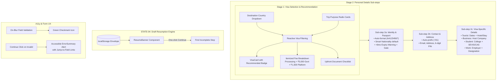

# Phase 2 Execution Walkthrough: Guided Journey (Visa Selection & Personal Details)

Phase 2 (_Guided Journey — Visa Selection & Personal Details_) has been executed, integrated, and verified against all requirements with **100% passing tests** across TypeScript typechecking, ESLint, WCAG AA contrast, font budgets, Vitest + axe accessibility, and Playwright end-to-end user journeys.

---

## 1. What Was Delivered

---

## 2. Key Component Deliverables

### Stage 1: Visa Selection & Transparency (`SELCT-01` – `SELCT-04`)

- **[VisaCard.tsx](file:///home/zeph/Code/horizon/src/features/visa/VisaCard.tsx)**: Displays category description, "Recommended for your trip" badge, processing duration badge, itemized fee breakdown (visa fee, government fee, platform fee, and total), and upfront required document checklist before committing.
- **[VisaSelectionScreen.tsx](file:///home/zeph/Code/horizon/src/features/visa/VisaSelectionScreen.tsx)**: Reactively filters catalog visas upon destination and trip purpose selection, managing selection state and errors.

### Stage 2: Personal Details Sub-steps (`PERS-01` – `PERS-06`)

- **[IdentityStep.tsx](file:///home/zeph/Code/horizon/src/features/personal/IdentityStep.tsx)** (Stage 2a): Captures Name, DOB, Gender, smart-defaulted Nationality ("India"), auto-formatted Passport Number (`AA1234567`), Date of Issue, and Date of Expiry with integrated `<6mo` validity check.
- **[ContactStep.tsx](file:///home/zeph/Code/horizon/src/features/personal/ContactStep.tsx)** (Stage 2b): Captures Email, auto-prefixed Indian Mobile Phone (`+91 98765 43210`), Residential Address, City, State, and 6-digit PIN Code.
- **[VisaSpecificStep.tsx](file:///home/zeph/Code/horizon/src/features/personal/VisaSpecificStep.tsx)** (Stage 2c): Progressively discloses specialized travel fields based on the selected visa category (Tourist, Business, Student, Work).
- **[PersonalDetailsScreen.tsx](file:///home/zeph/Code/horizon/src/features/personal/PersonalDetailsScreen.tsx)**: Sub-step orchestrator rendering a responsive sub-step breadcrumb (2a → 2b → 2c) and rendering the active sub-step form.

### Form UX & Error Management (`ERR-01`, `ERR-02`, `PERS-05`, `PERS-06`)

- **[ErrorSummary.tsx](file:///home/zeph/Code/horizon/src/components/ui/ErrorSummary.tsx)**: Focus-managed top-of-page alert box (`role="alert"`, `aria-live="polite"`) with smooth-scrolling jump links that shift focus directly to invalid fields.
- **[ExpiryWarning.tsx](file:///home/zeph/Code/horizon/src/components/ui/ExpiryWarning.tsx)**: Inline amber warning card explaining the 6-month passport validity requirement with required confirmation checkbox to advance.
- **[Field.tsx](file:///home/zeph/Code/horizon/src/components/ui/Field.tsx)**: Enhanced with `isValid` prop rendering a green checkmark icon when valid.

### Draft Resumption & App Shell Integration (`STATE-04`)

- **[ResumeBanner.tsx](file:///home/zeph/Code/horizon/src/components/ResumeBanner.tsx)**: Detects saved drafts, evaluates `getFirstIncompleteStep(answers)`, and allows returning applicants to jump directly to their active step.
- **[App.tsx](file:///home/zeph/Code/horizon/src/App.tsx)**: Full 5-stage progress indicator with live estimated minutes remaining, autosave status indicator, and screen routing.

---

## 3. Test & Verification Summary

| Verification Suite    | Command               | Result                                                    |
| :-------------------- | :-------------------- | :-------------------------------------------------------- |
| **Static Types**      | `pnpm typecheck`      | ✅ **0 Errors**                                           |
| **Linter & Rules**    | `pnpm lint`           | ✅ **0 Warnings / Errors**                                |
| **Color Contrast**    | `pnpm check:contrast` | ✅ **All color pairs pass WCAG AA**                       |
| **Font Budgets**      | `pnpm check:fonts`    | ✅ **All subsets within budget**                          |
| **Unit & A11y Tests** | `pnpm test`           | ✅ **35 test files, 112 tests passed (0 axe violations)** |
| **Playwright E2E**    | `pnpm e2e`            | ✅ **7 test suites passed (100%)**                        |

### Verified E2E Scenarios:

1. **Happy Path Journey:** Destination & purpose selection → Recommended visa card → Stage 2a Identity with auto-formatting → Stage 2b Contact with +91 phone formatting → Stage 2c Tourist specific fields → Advancing to Stage 3.
2. **Error Summary Navigation:** Validating required fields on Continue attempt, rendering top-of-page alert, clicking jump link focuses the problem input.
3. **Passport Expiry Warning (`PERS-05`):** Expiry date <6 months triggers amber warning and blocks Continue until confirmation checkbox is checked.
4. **Draft Persistence & Resumption (`STATE-04`):** Autosave flushes to `localStorage`, browser reload resumes directly on active step, and navigating to Stage 1 renders the `ResumeBanner` with target step jump link.
5. **Tab Kill Durability:** Unsaved keystrokes survive tab murder via `pagehide` flush.
6. **Derived Persistence:** Changing trip purpose dynamically preserves personal details across stages.
7. **Smoke Test:** Header, wordmark, and skip link render without console errors.
